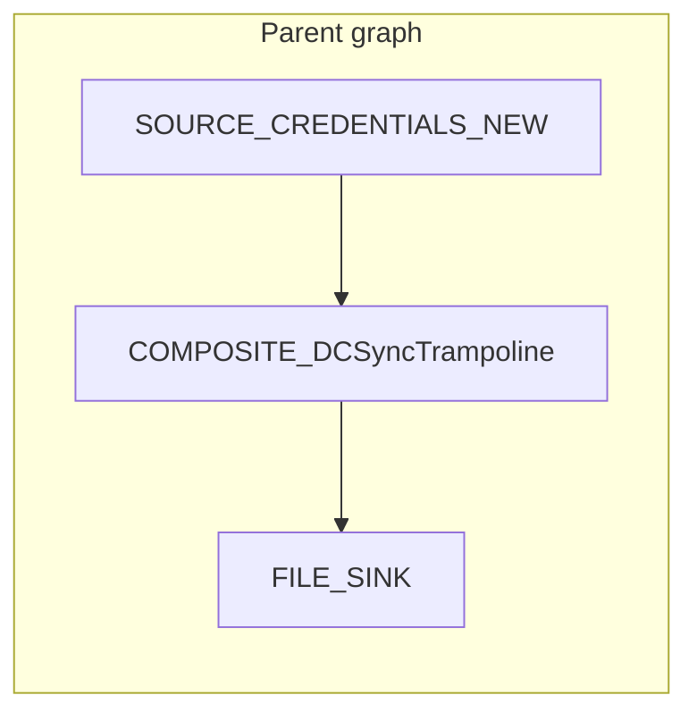

# Composites

A **composite** is a piece of a flowgraph saved as a reusable, named
block with its own typed port surface. They are the flowgraph
equivalent of writing a function: define inputs, define outputs, hide
the implementation, drop the result into other graphs.



The outside of the composite looks like any other block. The inside is
a normal flowgraph augmented with **boundary blocks** that define the
external port surface.

---

## The boundary blocks

Two special block types only exist inside composite inner graphs:

| Block             | Role |
|-------------------|------|
| `BOUNDARY_INPUT`  | A source-shaped block that emits items the parent pushed into the matching composite input port. |
| `BOUNDARY_OUTPUT` | A sink-shaped block that collects items the parent should receive on the matching output port. |

Both blocks expose three parameters that the composite engine uses to
build the facade:

- `external_port` — the name of the port the parent sees. Must be
  unique within the composite.
- `type_name` — the wire type for that port. Pick something that
  matches what you intend to plumb through (e.g. `credential_smb`,
  `scan_result`, `any`).
- `output_port` / `input_port` — the inner handle id, almost always
  the default (`out` for inputs, `in` for outputs).

When you save a composite, the framework scans the inner graph for
boundary nodes and **derives the external port surface** from their
`external_port` + `type_name` settings. You never write the facade
JSON by hand.

---

## Authoring a composite

The typical UI workflow:

1. Build the inner pipeline on the canvas as you would any other
   flowgraph.
2. Replace the source(s) you want the parent to provide with
   `BOUNDARY_INPUT` blocks, one per external input port. Set
   `external_port` to something meaningful (`target`, `credential`,
   `pair`) and the matching wire type.
3. Replace the terminal sink(s) with `BOUNDARY_OUTPUT` blocks for the
   data the parent should see.
4. Pick **Save composite** in the toolbar, give it an ID
   (`COMPOSITE_<MyName>` — the validator enforces the prefix and the
   `[A-Za-z0-9_]+` character class) and a description, and confirm.

The composite is now registered, persisted to
`~/.octopwn/composites/<id>.json`, broadcast to the frontend, and
available in the palette. Drop it into other graphs like any other
block.

The same lifecycle is exposed on the CLI:

| Command                              | Effect |
|--------------------------------------|--------|
| `savecomposite <path-to-json>`       | Install a composite from a JSON file and persist it. |
| `compositefromdata <json>`           | Install from an inline JSON string. |
| `deletecomposite <id>`               | Remove from the registry and delete the on-disk file. |
| `listcomposites`                     | Print every registered composite and its port surface. |

---

## Persistence and sharing

Composites live in `~/.octopwn/composites/`. Each file is a JSON
document of the form:

```json
{
  "kind": "composite",
  "facade": { "id": "COMPOSITE_DCSyncTrampoline", "..." : "..." },
  "inner_flowgraph": { "id": "...", "nodes": ["..."], "edges": ["..."] }
}
```

To share a composite with a teammate, copy the file. To version a
team-wide library, commit them to a git repo and symlink the directory
into `~/.octopwn/composites/`. The composite registry is reloaded
every time the FLOWGRAPH util session starts.

---

## Execution semantics

A `COMPOSITE` node runs its inner flowgraph inside the parent's engine
context. A few rules worth knowing:

- **`RERUN_TRIGGER` is scoped.** A local trigger inside a composite
  only re-runs the inner graph (up to 50 times — see
  `_MAX_INNER_RERUNS` in `composite.py`). Use `RERUN_TRIGGER_GLOBAL`
  to bubble the rerun up to the outermost graph.
- **Frontend state is prefixed.** Inner node states are reported back
  to the frontend with the parent composite's node id as a prefix so
  the UI knows which canvas to update.
- **Composites nest.** A composite inner graph can contain other
  composites. The same `iter_state` is shared up and down the
  hierarchy, so feedback queues work across nesting.

---

## When to reach for a composite

| Situation                                                                      | Composite? |
|--------------------------------------------------------------------------------|------------|
| The same `OPEN_SESSION → CMD_DCSYNC → CREDENTIAL_QUEUE` block triplet appears in five different graphs. | Yes. |
| You want a "Roast + crack" subroutine you can drop in wherever you have an LDAP session. | Yes. |
| You want a one-off filter that you will only ever use in this graph. | No — keep it inline. |
| You want a piece of logic that needs to bubble new credentials back to the root pipeline. | Yes, but the inner sink must be `RERUN_TRIGGER_GLOBAL`, not `RERUN_TRIGGER`. |

A good composite has a small, opinionated port surface and is
**named after the behaviour it provides**, not after the blocks it
contains. Future-you will thank present-you for `COMPOSITE_HarvestADCSCerts`
over `COMPOSITE_PipelineV3`.
