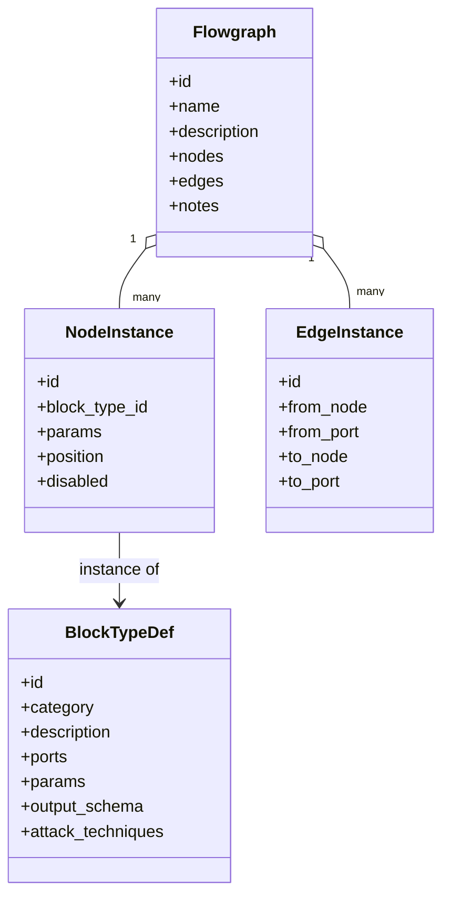
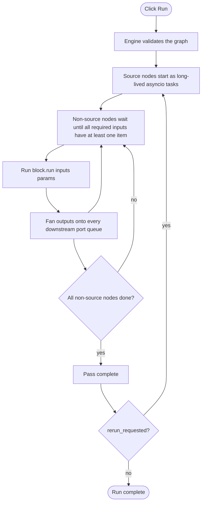
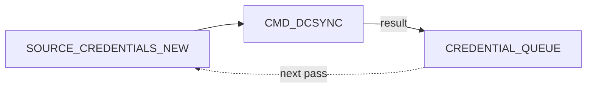

# Core concepts

This page explains the data model that the rest of the flowgraph
documentation assumes you understand. Read it once and the recipes
become readable at a glance.

---

## The shape of a flowgraph

A flowgraph is a JSON document with three lists: **nodes**, **edges**
and (optionally) **notes**. Each node is an instance of a **block
type** registered in
`octopwn/enterprise/flowgraph/registry.py`.

You will rarely write this JSON by hand. The UI is the authoring
surface, and the JSON is what gets saved, version-controlled and fed
into `loadfile` for replay runs.

---

## Blocks, ports and items

A **block** is a unit of behaviour — open a session, run a scanner,
filter a stream, save to disk. Each block exposes:

- **Ports** — typed, named input / output channels. A port is either
  `direction=input` or `direction=output`, has a `type_name` (the
  wire type), and may be marked `optional=true` (rendered dashed in
  the editor and not required for a node to run).
- **Parameters** — static configuration values set per node from the
  config panel. Examples: the wordlist path for a `HASHCAT_WORDLIST`,
  the LDAP filter for a custom query, the `ports` list for
  `SCANNER_PORTSCAN`.
- **Output schema** — for blocks that emit dict-shaped items, the
  registry documents the fields each output port produces. The
  frontend uses this to populate FILTER autocomplete.
- **Attack techniques** — optional list of MITRE ATT&CK technique IDs,
  surfaced in the kill-chain report.

Items flowing along a wire are normal Python dicts. Most carry a small
set of well-known keys:

| Key                          | Meaning |
|------------------------------|---------|
| `__tid`                      | Target store ID — populated whenever the item is anchored to a stored target. |
| `__cid`                      | Credential store ID — populated whenever the item is anchored to a stored credential. |
| `__session_id`               | Session reference ID — present on `session_*` items emitted by `OPEN_SESSION_*`. |
| `__jid`                      | Journal ID — a monotonically increasing integer that links the item back to the journal entry that produced it. Used by [killchain](reporting.md). |
| `__source_flowgraph_hid`     | History ID of the run that produced the item — supports cross-run provenance. |

Block descriptions in the [block reference](blocks/index.md) tell you
which keys each block writes onto its outputs.

---

## Wire types and matching rules

The engine refuses to connect output ports to input ports unless their
`type_name` is compatible. A few key rules:

- Exact type match always connects (`scan_result → scan_result`).
- The `any` type matches anything in either direction — used for
  generic sinks (`TERMINATOR_SINK`, `FILE_SINK`, `TAP_SINK`).
- `raw_target` connects into ports that accept `raw_target` or
  `scan_result` — most scanners accept either, with `__tid` resolved
  from the dict at run time.
- The `credential_*` family of types (one per protocol) flows out of
  `CREDMUX` and into matching scanner / session / attack ports. The
  full list lives in [typing & wiring](typing-and-wiring.md).
- `session_<client>` types are 1:1 with `OCTOPWN_CLIENT_TABLE` — for
  every client there is a corresponding `OPEN_SESSION_<CLIENT>` and
  `session_<client>` wire type.

---

## How the engine runs

Two consequences worth internalising:

1. **Sources never block.** They emit items continuously (or in a
   one-shot burst for non-`*_NEW` sources). Downstream blocks queue
   the items and consume them when they have what they need.
2. **The graph runs to completion every pass.** Pass-driven design
   means a flowgraph that is "correct" for a single host stays
   correct for ten thousand hosts — the engine simply runs more
   times.

---

## Snapshot vs. new-only sources

Two variants exist for every source that pulls from a store
(credentials, targets, sessions):

- `SOURCE_<X>` emits the **full snapshot** of the store at the moment
  the source starts. Use in single-shot runs or whenever you need
  every item every iteration.
- `SOURCE_<X>_NEW` emits **only items not yet seen this runloop**,
  plus anything pushed into the matching `<X>_QUEUE` sink. This is
  how feedback loops are wired:

`CREDENTIAL_QUEUE` is a sink. The credentials it receives become
the input for `SOURCE_CREDENTIALS_NEW` on the **next** engine pass,
bypassing the "already seen" filter.

`SOURCE_CREDENTIALS_NEW` in a single-shot `run` behaves exactly like
`SOURCE_CREDENTIALS` — the "new-only" filter only kicks in once there
is a prior pass to compare against.

---

## Cross-run state (`iter_state`)

When you call `run`, `continuous` or `runloop` the executor allocates an
`iter_state` dict that persists across passes. Three flavours of state
live in it:

- **Seen ID sets** — `seen_cred_ids`, `seen_target_ids`. Populated by
  `*_NEW` sources every time they emit an item.
- **Pending queues** — `cred_queue`, `target_queue`,
  `session_queues`, `named_target_queues`. Filled by `*_QUEUE`
  sinks, drained by `*_NEW` sources on the following pass.
- **Execution journal** — a per-pass list of every block invocation
  with its inputs, outputs (summarised), parameters and timestamp.
  This is what [killchain](reporting.md) walks.

`resetstate` clears everything. Use it whenever you want a clean
slate without restarting the FLOWGRAPH util session.

---

## Categories at a glance

The registry organises blocks into categories that map onto the pages
in the [block reference](blocks/index.md):

| Category        | Role                                                                  |
|-----------------|-----------------------------------------------------------------------|
| `SOURCE`        | Emits items (credentials, targets, sessions, raw strings) into the graph. |
| `PROMPT_SOURCE` | Same as SOURCE but pops an input dialog before running. Tutorial-friendly. |
| `QUEUE`         | Feedback sinks — hold items for the next runloop iteration.         |
| `SINK`          | Terminators — discard, write to disk, or trigger a rerun.           |
| `TAP`           | Pass-through probe; lets you inspect a wire from the results panel. |
| `CONSOLE`       | Pass-through logger — formats and prints each item.                  |
| `CREDMUX`       | Routes a credential stream to protocol-typed output ports.           |
| `FILTER`        | Conditional routing, set membership, gates, port gates, deduplication. |
| `SCANNER`       | One block per entry in `OCTOPWN_SCANNER_TABLE`.                      |
| `SESSION`       | `OPEN_SESSION_*` plus the ID splitter helpers.                       |
| `COMMAND`       | `CMD_*` — run any client command on a live session.                  |
| `ATTACK`        | Curated wrappers around `OCTOPWN_ATTACK_TABLE`.                      |
| `ENUMERATION`   | Stream LDAP datasets (users / computers / templates / trusts).       |
| `TRANSFORM`     | Convert one credential type to another (PFX→NT, hashcat cracking).   |
| `SCRIPT`        | User-authored Python coroutine.                                      |
| `BOUNDARY`      | Input / output boundary blocks inside composite inner graphs.        |
| `COMPOSITE`     | User-saved composites — facades over a nested flowgraph.             |

That is the whole conceptual surface. Everything else in the docs is
either UI mechanics, opsec knobs, or example wirings of these pieces.
