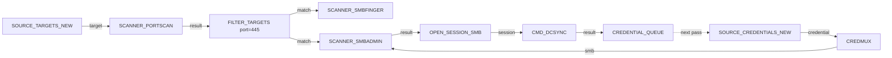

# Flowgraph

**Flowgraph** is OctoPwn's visual, node-based automation framework. You
drag blocks onto a canvas, wire their typed ports together, and the
engine executes the resulting graph end-to-end — credentials, targets
and sessions flow along the wires the same way data flows through a
real pentest.

Unlike every other plugin in OctoPwn, flowgraph is **designed to be
operated from the UI**. The frontend is the primary surface: a block
palette, a canvas with live execution colouring, per-node configuration
panels, and a results inspector. There is a CLI session (`createutil
FLOWGRAPH`) for power users and for loading graphs from JSON files
during scripted runs, but most operators will build, save and run
flowgraphs without ever touching the console.

!!! info "Enterprise feature"
    Flowgraph ships with OctoPwn **Enterprise**. The block registry,
    engine and UI are part of the enterprise build only.

---

## What it replaces (and what it does not)

| Need                                                      | Use                          |
|-----------------------------------------------------------|------------------------------|
| Hand-off the engagement to an LLM-driven assistant        | [Autopwn](../autopwn.md)     |
| Probe a single host / a couple of hosts interactively     | The relevant **client** plugin |
| Sweep a single check across the whole inventory           | A single **scanner**         |
| Chain discovery → auth → exploit with **feedback loops**, scheduling, opsec controls and a kill-chain audit trail | **Flowgraph** |

Autopwn aims for "hands off the wheel"; flowgraph aims for "every
decision was mine and I can prove it later." A typical flowgraph is a
deterministic, auditable script of an engagement that you can re-run
against a different scope, hand to a colleague, or attach to the report.

---

## The 30-second mental model

A flowgraph is a directed graph of **block instances** connected by
**typed wires**. Each block has a small set of input and output ports;
the engine fans output items onto every wired downstream port and only
runs a block once each of its required inputs has at least one item.

The credential and target queues at the bottom right are what make
flowgraph special: anything `CMD_DCSYNC` discovers is fed back into the
next runloop iteration and tried against everything the portscan
discovered, automatically.

---

## Where to go next

This documentation is split along the same axes as the framework itself:

- **[Core concepts](concepts.md)** — the data model (blocks, ports,
  items, wire types, runloop state) you need to read flowgraphs
  fluently.
- **[UI tour](ui-tour.md)** — opening the flowgraph window, the
  palette, the canvas, the config panel and the results inspector.
- **[Run modes & opsec](run-modes.md)** — single run, continuous,
  runloop, RERUN_TRIGGER, plus rate / jitter / concurrency controls.
- **[Typing & wiring](typing-and-wiring.md)** — the full catalogue of
  wire types and the rules the engine uses to decide which ports can
  connect to which.
- **[Composites](composites.md)** — saving a piece of a flowgraph as a
  reusable, named block with its own typed port surface.
- **[Script block](script-block.md)** — escape hatch for the cases the
  built-in vocabulary cannot express.
- **[CLI reference](cli.md)** — the `createutil FLOWGRAPH` console for
  scripted, file-backed runs.
- **[Reporting & killchain](reporting.md)** — the execution journal
  and the `killchain` tool that walks it.
- **[Recipes](recipes/index.md)** — six small, complete pipelines that
  show how the pieces snap together.
- **[Block reference](blocks/index.md)** — the auto-generated catalogue
  of every block type in the registry.
