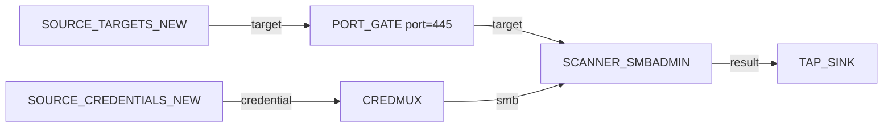

# Credential spray

Validate every credential in the store against every SMB-speaking host
in the project — without trying credential types SMB can't use, and
without re-scanning the same `(host, credential)` pair twice.

---

## Goal

Produce a list of `(host, credential)` pairs that resulted in
successful SMB admin access. This is the "I have hashes; what can I do
with them" check that should run after every fresh credential is
added to the store.

---

## Pipeline



---

## Block-by-block

- [`SOURCE_TARGETS_NEW`](../blocks/sources.md) — emits targets not
  seen in a previous runloop iteration, plus anything pushed into
  `TARGET_QUEUE`. In a single-shot run behaves like
  `SOURCE_TARGETS`.
- [`SOURCE_CREDENTIALS_NEW`](../blocks/sources.md) — credential
  equivalent. Pair with `SOURCE_TARGETS_NEW` so each run only
  processes new combinations of `(target, credential)`.
- [`PORT_GATE`](../blocks/filters.md) — only lets targets with
  445/TCP open through. Runs a `SCANNER_PORTSCAN` automatically
  on targets that have no port data yet.
- [`CREDMUX`](../blocks/credmux.md) — fans the credential stream onto
  protocol-typed output ports. We only consume `smb`; every other
  credential type is silently dropped.
- [`SCANNER_SMBADMIN`](../blocks/scanners.md) — tests SHARE, SERVICE
  and REGISTRY admin access for each `(target, credential)` pair.
  Setting `skip_done=true` makes repeated runs ignore pairs already
  processed; useful when `runloop`ing.
- [`TAP_SINK`](../blocks/queues-sinks.md) — visible terminator.

The implicit cross-product on `SCANNER_SMBADMIN`'s `target` and
`credential` input ports turns `M` targets × `N` credentials into
`M*N` attempts, all subject to the engine's max-concurrent / rate /
jitter knobs.

---

## Saved graph

```json
{
  "id": "credential-spray",
  "name": "Credential spray",
  "description": "Every credential against every SMB host on 445.",
  "nodes": [
    {"id": "tgt-1",  "block_type_id": "SOURCE_TARGETS_NEW",     "params": {}, "position": {"x":   0, "y":  60}},
    {"id": "pg-1",   "block_type_id": "PORT_GATE",              "params": {"port": 445, "protocol": "TCP"}, "position": {"x": 260, "y": 60}},
    {"id": "cred-1", "block_type_id": "SOURCE_CREDENTIALS_NEW", "params": {}, "position": {"x":   0, "y": 240}},
    {"id": "mux-1",  "block_type_id": "CREDMUX",                "params": {}, "position": {"x": 260, "y": 240}},
    {"id": "spray-1","block_type_id": "SCANNER_SMBADMIN",       "params": {"skip_done": true, "timeout": 8}, "position": {"x": 560, "y": 150}},
    {"id": "tap-1",  "block_type_id": "TAP_SINK",               "params": {}, "position": {"x": 860, "y": 150}},
    {"id": "drop-1", "block_type_id": "TERMINATOR_SINK",        "params": {}, "position": {"x": 560, "y": 320}}
  ],
  "edges": [
    {"id": "e1", "from_node": "tgt-1",  "from_port": "target",     "to_node": "pg-1",    "to_port": "target"},
    {"id": "e2", "from_node": "pg-1",   "from_port": "target",     "to_node": "spray-1", "to_port": "target"},
    {"id": "e3", "from_node": "pg-1",   "from_port": "no_port",    "to_node": "drop-1",  "to_port": "data"},
    {"id": "e4", "from_node": "cred-1", "from_port": "credential", "to_node": "mux-1",   "to_port": "credential_in"},
    {"id": "e5", "from_node": "mux-1",  "from_port": "smb",        "to_node": "spray-1", "to_port": "credential"},
    {"id": "e6", "from_node": "spray-1","from_port": "result",     "to_node": "tap-1",   "to_port": "data"}
  ]
}
```

---

## Assembled view


---

## Variations

- **Filter to admins only.** Insert a
  [`FILTER`](../blocks/filters.md) after `SCANNER_SMBADMIN` with
  `key=SHARE, op=eq, value=true` and route only the matches into
  the next stage.
- **Track who is also a sysadmin on MSSQL.** Add a parallel
  `SCANNER_MSSQLADMIN` consuming `mux.mssql` and `pg.target` for
  TCP/1433. The graph is now a two-protocol spray with the same
  cross-product semantics.
- **Quietest possible spray.** Lower `workercount` on the scanner
  (it is registered as an SMBScanParameters field if you toggle the
  advanced view) and combine with `setjitter 2 8`. The cross-product
  becomes serialised, slow, and traffic-shaped.
