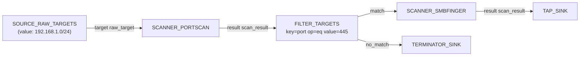

# Portscan + SMB finger

The bread-and-butter discovery chain: sweep a target range for open
TCP ports, then collect SMB server fingerprints from every host with
445/TCP open.

---

## Goal

Given a list of raw target strings (CIDRs, IPs, hostnames), produce a
collection of `SMBFINGER` result items containing the domain name,
computer name, OS guess, and server time of every SMB-speaking host.

---

## Pipeline



---

## Block-by-block

- [`SOURCE_RAW_TARGETS`](../blocks/sources.md) — one-shot source that
  emits raw target strings. Configure with the CIDR(s) /
  hostnames you want to sweep.
- [`SCANNER_PORTSCAN`](../blocks/scanners.md) — TCP-connect scanner.
  Default `ports=[445, 22, 88, 3389]` is fine; tighten to `[445]`
  if you only care about SMB. Sets `__tid` and auto-registers
  discovered open ports as target-port entries in the project.
- [`FILTER_TARGETS`](../blocks/filters.md) with `key=port, op=eq,
  value=445` — only forward results that represent open 445/TCP.
- [`SCANNER_SMBFINGER`](../blocks/scanners.md) — unauthenticated
  SMB NTLM handshake fingerprint. Output schema includes
  `domainname`, `computername`, `dnscomputername`, `os_guess`,
  `os_build`, `local_time` — enough to populate the basic columns
  of an asset inventory.
- [`TAP_SINK`](../blocks/queues-sinks.md) — inspectable terminator so
  the results show up in the panel.
- [`TERMINATOR_SINK`](../blocks/queues-sinks.md) — drops the
  no-port-445 stream so the engine does not complain about
  unconnected outputs.

---

## Saved graph

```json
{
  "id": "portscan-smbfinger",
  "name": "Portscan + SMB finger",
  "description": "TCP sweep + SMB NTLM fingerprint for everything on 445.",
  "nodes": [
    {
      "id": "src-1",
      "block_type_id": "SOURCE_RAW_TARGETS",
      "params": {"targets": ["192.168.1.0/24"]},
      "position": {"x": 0, "y": 100}
    },
    {
      "id": "portscan-1",
      "block_type_id": "SCANNER_PORTSCAN",
      "params": {"ports": ["445"], "timeout": 5},
      "position": {"x": 280, "y": 100}
    },
    {
      "id": "filter-445-1",
      "block_type_id": "FILTER_TARGETS",
      "params": {"key": "port", "op": "eq", "value": "445"},
      "position": {"x": 560, "y": 100}
    },
    {
      "id": "smbfinger-1",
      "block_type_id": "SCANNER_SMBFINGER",
      "params": {"timeout": 10},
      "position": {"x": 860, "y": 60}
    },
    {
      "id": "tap-1",
      "block_type_id": "TAP_SINK",
      "params": {},
      "position": {"x": 1140, "y": 60}
    },
    {
      "id": "drop-1",
      "block_type_id": "TERMINATOR_SINK",
      "params": {},
      "position": {"x": 860, "y": 200}
    }
  ],
  "edges": [
    {"id": "e1", "from_node": "src-1",        "from_port": "target",   "to_node": "portscan-1",   "to_port": "target"},
    {"id": "e2", "from_node": "portscan-1",   "from_port": "result",   "to_node": "filter-445-1", "to_port": "target"},
    {"id": "e3", "from_node": "filter-445-1", "from_port": "match",    "to_node": "smbfinger-1",  "to_port": "target"},
    {"id": "e4", "from_node": "filter-445-1", "from_port": "no_match", "to_node": "drop-1",       "to_port": "data"},
    {"id": "e5", "from_node": "smbfinger-1",  "from_port": "result",   "to_node": "tap-1",        "to_port": "data"}
  ]
}
```

---

## Assembled view


---

## Variations

- **Multiple ports + multiple scanners.** Add more `SCANNER_*`
  branches after `FILTER_TARGETS`, each filtered on its own port —
  e.g. `SCANNER_SSHBANNER` on 22, `SCANNER_HTTPFINGER` on 80 / 443,
  `SCANNER_MSSQLFINGER` on 1433.
- **Persist results to disk.** Replace `TAP_SINK` with a `FILE_SINK`
  configured with `filename=smbfinger_results.jsonl`. The file is
  written to the OctoPwn workdir and survives across browser
  refreshes.
- **Stay opsec-quiet.** Set `setrate 20` and `setjitter 0.5 2` in the
  console before hitting Run — the portscan stays under twenty
  connect attempts per minute with half-to-two-second jitter.
