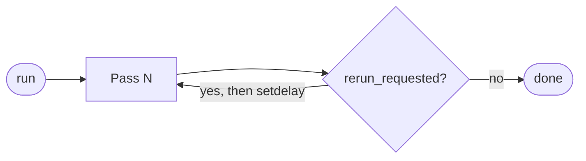

# Run modes & opsec controls

A flowgraph is a *description* of work. How that work is dispatched is
determined by the run mode you pick from the FLOWGRAPH window
toolbar (or the equivalent console command).

There are three run modes plus a set of orthogonal opsec / pacing knobs
that apply to all of them.

---

## The three modes

### `run` — single pass with RERUN_TRIGGER convergence

`run` executes the graph once. If a `RERUN_TRIGGER` (local) or
`RERUN_TRIGGER_GLOBAL` sink receives any items during the pass, the
engine schedules another pass after `setdelay` seconds (zero by default)
and re-runs until no rerun is requested.

This is the right mode for **deterministic engagements**: load the
graph, hit Run, walk away. You get a kill-chain audit trail that
matches the engagement exactly.



### `continuous <interval>` — periodic re-execution

`continuous 180` runs the full graph (including any RERUN_TRIGGER
convergence), then sleeps for 180 seconds, then runs it again, and so
on, with `iter_state` preserved across cycles. The window keeps the
"sleeping until …" indicator visible between cycles.

Use this for **long-running monitoring tasks** — keep scraping new
LDAP users every five minutes, re-roast every newly created service
account, etc. Pair with `setjitter` so the cycle does not become a
detectable cadence.

`continuous` accepts optional ISO-8601 `start_at` and `stop_at`
timestamps so you can schedule the run for a specific maintenance
window:

```
continuous 300 2026-04-15T22:00:00 2026-04-16T04:00:00
```

### `runloop [max_iterations]` — run until convergence

`runloop` iterates the graph until **nothing new was discovered**: no
new credentials, no new targets, no items pending in any queue. Each
iteration prints a status line so you can see the store grow and
stabilise.

Use this when you have a self-feeding pipeline (e.g. DCSync → queue →
roast → crack → queue → re-spray) and you want it to walk itself to a
fixed point. Pass `max_iterations` to cap how long it will run.

```
runloop          # unlimited
runloop 5        # at most 5 passes
```

---

## Picking the right mode

| Situation                                                                | Mode         |
|--------------------------------------------------------------------------|--------------|
| A graph that should run once and stop, even if no rerun is wired         | `run`        |
| A graph with one or two `RERUN_TRIGGER`s that should converge naturally  | `run`        |
| A graph that should keep going until the store stops growing             | `runloop`    |
| A graph used as a long-running watchdog                                  | `continuous` |
| A scheduled engagement window with explicit start / stop times           | `continuous` |

---

## RERUN_TRIGGER vs RERUN_TRIGGER_GLOBAL

Both are silent sinks — the items they receive are discarded; only the
fact that they received something matters. The difference is **scope**:

- `RERUN_TRIGGER` re-runs the **current** scope. At the top level that
  is the whole graph; inside a composite block it re-runs only the
  composite's inner graph.
- `RERUN_TRIGGER_GLOBAL` always re-runs the **outermost** graph, no
  matter how deeply nested the trigger is.

Use `RERUN_TRIGGER_GLOBAL` inside composites when an inner-graph
discovery (a new credential, a new target) should restart the entire
parent pipeline.

---

## Opsec controls

All four controls are global to the FLOWGRAPH util session and apply
to every subsequent run. Set them once before kicking off a run; they
persist until the session ends or you change them.

### `setmaxconcurrent <n>`

Caps the number of concurrently running nodes across the entire engine.
`0` (the default) means unlimited. Lower this when you are worried
about saturating your egress link or hammering a single subnet.

```
setmaxconcurrent 3
```

### `setrate <ops_per_minute>`

Caps how often a new node can start. Useful when you want to keep the
scan footprint smooth rather than burst-y. `0` disables the limit.

```
setrate 30        # at most 30 node-starts per minute
```

### `setjitter <min_seconds> <max_seconds>`

Adds a uniformly random delay before each node starts. Combine with
`setrate` to break up cadenced traffic.

```
setjitter 0.5 4
```

### `setdelay <seconds>` (RERUN delay)

Delay between RERUN_TRIGGER-triggered passes inside a single `run` or
`continuous` invocation. Defaults to `0`.

```
setdelay 30
```

### `setnodedelay <seconds>` (DEMO ONLY)

Forces each node to stay visually `RUNNING` for at least N seconds.
**Only use for presentations**; it does nothing for real engagements
except slow them down. Reset to `0` afterwards.

```
setnodedelay 1.5    # presentation pace
setnodedelay 0      # back to normal
```

---

## State management

| Command       | Effect |
|---------------|--------|
| `resetstate`  | Clears `iter_state` (seen IDs, queues, journal). Next run starts from scratch. |
| `stop`        | Cancels the running task and any scheduled stop timer. |

`resetstate` is the right tool when:

- You finished a runloop and want a clean start for the next graph.
- The `*_NEW` sources are returning nothing because everything is in
  `seen_*_ids` — typically because you re-ran the graph without
  resetting and there really is nothing new.
- You want a fresh journal for a kill-chain report.

---

## Putting it together

A real opsec-tuned run might look like:

```
> setmaxconcurrent 4
> setrate 24
> setjitter 1 3
> setdelay 15
> loadfile engagements/acme/wave1.json
> run 2026-04-15T22:00:00 2026-04-16T03:30:00
```

— at most four nodes at a time, twenty-four starts per minute,
one-to-three seconds of jitter, fifteen seconds between rerun-driven
passes, starting at 22:00 and auto-stopping at 03:30.

See the [CLI reference](cli.md) for the full command list.
