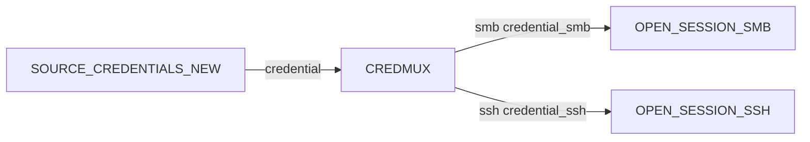

# Typing & wiring

Every port has a **wire type**. The engine refuses to connect ports
whose types are incompatible, and the editor only draws connectable
ports when you start a drag from a port. This page is the cheat sheet
that explains why a given connection is or is not allowed.

---

## The wire-type catalogue

The types you will see in port tooltips, organised by what they carry.

### Targets

| Type            | Carries                                                                |
|-----------------|------------------------------------------------------------------------|
| `raw_target`    | A `{value: str}` dict containing an IP, hostname or CIDR string. Emitted by `SOURCE_RAW_TARGETS` / `PROMPT_SOURCE_TARGETS`. |
| `scan_result`   | A stored-target dict carrying at least `__tid`; usually with scanner-specific fields merged in (port, service, hostname, etc.). |

`raw_target` flows into scanner / attack / utility ports. To open a
session you need a `scan_result` (the engine needs an actual stored
target so the session has a `__tid` to remember its origin). Convert
with `STORE_TARGETS`.

### Credentials

| Type                      | Carries |
|---------------------------|---------|
| `credential`              | Generic credential dict with `__cid`. Flows out of every credential source and into `CREDMUX`. |
| `credential_smb`          | SMB-usable credential (password, NT, RC4, AES, Kerberos). |
| `credential_ldap`         | LDAP-usable credential. |
| `credential_krb`          | Kerberos-usable credential. |
| `credential_ssh`          | SSH-usable credential (password, SSH private key). |
| `credential_rdp`          | RDP-usable credential. |
| `credential_winrm`        | WinRM-usable credential (incl. CredSSP / SPNEGO variants). |
| `credential_mssql`        | MSSQL-usable credential. |
| `credential_wmi`          | WMI-usable credential. |
| `credential_ftp`          | FTP-usable credential (password). |
| `credential_vnc`          | VNC-usable credential. |
| `credential_dcedrsuapi`   | DCEDRSUAPI-usable credential — used for DCSync via RPC. |
| `credential_snmp`         | SNMP community string. |

The protocol-specific variants are **only produced by `CREDMUX`**.
If you wire a `SOURCE_CREDENTIALS` directly to an `OPEN_SESSION_SMB` the
editor will refuse the connection because `credential` is not the same
as `credential_smb`. The right pattern is always:

`CREDMUX` matches each incoming credential against the allowed secret
types for each protocol and silently drops incompatible types on
the unused output ports.

### Sessions

| Type                  | Carries                                       |
|-----------------------|-----------------------------------------------|
| `session_<client>`    | A `{session_id, target_id, credential_id}` reference for a live `<client>` session. One type per entry in `OCTOPWN_CLIENT_TABLE`. |

`session_ldap`, `session_smb`, `session_rdp`, `session_kerberos`,
`session_dcedrsuapi`, `session_mssql`, `session_ssh`, `session_wmi`,
`session_winrm`, `session_ftp`, `session_netcat`, `session_nfs3`,
`session_snmp`, `session_ntp`, `session_dns`.

### Datasets

| Type                    | Carries                                              |
|-------------------------|------------------------------------------------------|
| `dataset_users`         | Individual user dicts from `ENUM_LDAP_USERS`.        |
| `dataset_computers`     | Individual computer dicts from `ENUM_LDAP_COMPUTERS`. |
| `dataset_templates`     | ADCS template dicts from `ENUM_LDAP_ADCS_TEMPLATES`. |
| `dataset_trusts`        | Trust dicts from `ENUM_LDAP_TRUSTS`.                 |

Datasets are streamed via `StorageRef` — the engine pulls items lazily
from the LDAP client's on-disk SQLite, so a 100 000-user domain does
not blow up your memory.

### Errors and generic

| Type        | Carries                                                                |
|-------------|------------------------------------------------------------------------|
| `error`     | Error dict from `OPEN_SESSION_*` or `CMD_*` when something fails.     |
| `any`       | Wildcard — connects to anything. Used by generic sinks and taps.       |

---

## Type compatibility rules

The validator and the editor agree on a small set of rules:

1. **Identical types always connect.**
2. **`any` matches anything in either direction.** That is why
   `FILE_SINK`, `TERMINATOR_SINK`, `TAP_SINK` and `CONSOLE` can be
   wired onto any wire — they accept `data: any`.
3. **`raw_target` upcasts to `scan_result` for scanner inputs.** Most
   scanner `target` ports declare `raw_target` but happily accept
   `scan_result` items because they only care about the value lookup
   keys (`value`, `__tid`, `ip`, `target`, `serverip`).
4. **Protocol credentials only come from `CREDMUX`.** No other block
   produces `credential_smb` / `_ldap` / etc.
5. **Cross-product semantics on `host` + `credential` ports.**
   `OPEN_SESSION_*` exposes both a `host` port and a `credential`
   port. If both are wired, the engine cross-products them: each host
   × each credential becomes one session attempt. To avoid the
   cross-product, wire a combined `scan_result` (with both `__tid`
   and `__cid` set) to the `result` input port instead — that opens
   exactly one session per item.

---

## Common wiring mistakes

These come up enough that they are worth flagging explicitly.

**1. Wiring `SOURCE_CREDENTIALS` straight to a scanner credential
port.** The types do not match. Always route through `CREDMUX`.

**2. Forgetting `CREDMUX` and getting an unexpected explosion.**
Without `CREDMUX`, a scanner that supports multiple credential families
will try every credential against every target, including credentials
of types it cannot use. CREDMUX is also where you filter so each
protocol only sees its own credentials.

**3. Using `SOURCE_TARGETS` in a runloop.** `SOURCE_TARGETS` emits the
full snapshot every pass, which defeats the point of the runloop.
Use `SOURCE_TARGETS_NEW` so each pass only processes newly discovered
targets.

**4. Wiring an `error` output into a `data` input that expects
results.** The `error` ports from `OPEN_SESSION_*` and `CMD_*` produce
error dicts, not results. Wire them into a `TERMINATOR_SINK` (or a
`CONSOLE` if you want to log them) to keep the validator happy.

**5. Putting a `STORE_TARGETS` after a CIDR-emitting source.**
`STORE_TARGETS` skips CIDR ranges with a warning — it is meant for
pinning a small number of specific hosts. Use `SCANNER_PORTSCAN` to
turn a CIDR range into discovered target-port entries instead.

**6. Wiring a `host` and a `credential` port and expecting one
attempt.** That is the cross-product trap. Use `ID_SPLITTER_PAIR` or
plug the combined `scan_result` straight into the `result` port.

---

## Output schemas and FILTER autocomplete

Every block that emits dict-shaped items declares an `output_schema` in
the registry — a list of `(name, type_name, description)` tuples for
each output port. The frontend reads this schema to populate the
autocomplete dropdown on FILTER's `key` parameter, and the
[block reference](blocks/index.md) renders these tables under each
block.

If you are writing a `SCRIPT` block that produces items, mirror the
shape of upstream items so downstream FILTERs continue to work — that
is, preserve `__tid` / `__cid` / `__jid` keys when you can.
