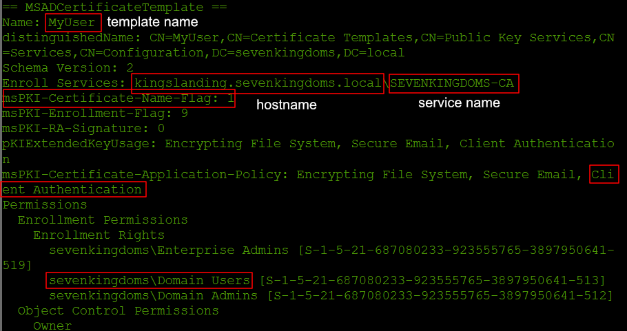

hints on why its cool, what to do - link to enum - apts, ...

# SMB Client plugin
The SMB Client plugin within the "octopwn" framework, is designed to interact with a target system via SMB and DCE/RPC operations. 

The SMB Client plugin primarily communicates with remote services via SMB pipes. Unlike the traditional method of connecting to the portmapper, and then connecting to the services via specific TCP or UDP ports, the smb plugin uses named pipes that can be interacted with via the IPC$ share. This method allows for reading and writing data as if interacting with a regular socket but over SMB and provides several advantages over the traditional portmapper approach: 

- Single Authentication: Typically, there is no need to authenticate a second time when accessing services via SMB pipes, simplifying the process.
- Broad Service Interaction: While not all services are available as SMB pipes, many critical ones are, allowing for diverse interaction capabilities.

## Getting Started

To use the SMB Client plugin, select the credentials and the target and then create a client of type SMB in the Main GUI. This will open the SMB2 Client window with the selected credentials and the target and mount a the files in the file browser that can be access by clicking the `FILES` client in the client list. For most operations you will need to run the `login` command to get started.

### SMB File browser
After sucsessfully creating the client, the SMB files will automatically be mounted as `smb-<clientid>` in the file explorer.
The file browser supports basic file operations as you'd expect from a file browser like downloading and uploading files, removing and creating directories.

## Commands
As usual, all functionalities will be discussed in command groups which logically group commands of similar nature.

### Connection
#### Login
Performs an SMB login to the target server using the credentials selected when creating the SMB client. 
#### Logout
Terminates the connection after logging out gracefully.
#### Nodce
This is a pre-login command which disables all DCE operations for restricted systems which do not even allow listing of shares. (Because for some reason SMB doesn't support lisiting of shares without using an extra complex protocol...)

### File Operations
The File Management functionality within the SMB Client plugin allows viewing the files on the system and includes the capability to fetch Security Descriptors of directories and files within the mounted share's current directory which offers insights into permissions and potential misconfigurations.
The file operation commands are independent of the operations performed in the File Browser Window. For a more convenient file operation, use the file browser. Please take not that there is a seperate  [smb file scanner](../scanners/smbfile.html) available within OctoPwn. 

#### shares
Lists available shares on the target server. This is similar to the Windows command `net view`.
#### use
Mounts the share so further file operations can be perfomed on it. In the `share_name` input field, use a share name as listed with the `shares` command. 
#### cd
Changes current directory on the mounted share. 
#### get
Download a file or multiple files from the mounted share's current directory. Enter the name of the remote file to be downloaded in the text field. The file will be downloaded into the volatile browser storage. To access the files go to the file browser window and browse to `/browserfs/volatile`. From there you can download the file to your local Downloads folder.   

!!! warning

    Please note that these files will be removed when reloading or exiting OctoPwn!

#### put
Uploads a file to the mounted share's current directory. To upload a file, drag-and-drop a file into the browser window. The uploaded file will be saved into the volatile browser storage. It can be accessed via the file browser at `/browserfs/volatile`. After uploading the file into the browser storage you can  enter the file name into the `file_name` input field and then press put to upload the file.
#### del
Removes a file from the mounted share's current directory.
#### mkdir
Creates a new folder under the mounted share's current directory.
#### getdirsd
Fetches the raw Security Descriptor String of a directory in the the mounted share's current directory. 
This string provides detailed information about the security settings of a directory, including its owner, group, and the specific permissions (Access Control Entries, or ACEs) applied to it.

!!! info
    - Description of the Security Descriptor String format: 
    [Microsoft Security Descriptor String Format](https://learn.microsoft.com/en-us/windows/win32/secauthz/security-descriptor-string-format). 
    - Details on ACE entry descriptions: [Microsoft ACE Strings](https://learn.microsoft.com/en-us/windows/win32/secauthz/ace-strings)

#### getfilesd
Fetches the Security Descriptor of a file in the the mounted share's current directory. Like directories, files have Security Descriptors that define who can access them and what actions they can perform.
#### ls
Lists the contents of the mounted share's current directory.
#### dir
See `ls`
#### refreshcurdir
As the directory listing of the current directory is cached, this command is used to refresh the listing.
#### enumall
This function enumerates all shares recursively and goes through all files and folders and lists them. Do not use this as it will make octopwn slow.

### USER/GROUP MANAGEMENT

The User/Group Management feature of the SMB Client plugin leverages DCE/RPC, specifically the Security Account Manager Remote Protocol (SAMR), over SMB for enumeration and management of user accounts and groups locally and in the domain. 

#### domains
Lists all available domains the computer is a member of. Please note that this command does not list all domains in the forest, only the domains the computer is connected to.
#### domaingroups
Lists all groups of a given domain. Listing all groups within a domain helps identify potential targets for privilege escalation. Understanding group memberships can reveal interesting groups which allow access to other computers. This is the equivalent of the command `net group /domain`.
#### groupmembers
Lists all accounts in a given domain for a given group. By listing the group members it is possible to identify intersting accounts, such as local admins. Similar to `net group "Domain Admins"`.
#### users
Lists all users of a given domain. Enumerating all users of a given domain helps in building a comprehensive picture of the potential targets within the network. This information can be used to attempt credential stuffing, password spraying, or other types of authentication attacks. This is the equivalent of the command `net user /domain`.
#### localgroups
Lists all local groups on the target (using `Builtin` domain). This allows listing local groups which might be of interest. Similar to `net localgroup`.
#### localgroupmembers
Lists all accounts which are member of the given loal group. This could for example be the local `Administrators` group to find out the local admins on the system. You might also find a shared administrator user here, which allow lateral movement to multiple machines using a single set of credentials. Similar to `net localgroup Administrators`
#### session
Enumerates all active sessions using srvsvc. Note that depending on the configuration of the machine this might not return any session if in a non local admin context.


### SERVICE OPERATIONS

The Service Operations feature within the SMB Client plugin leverages the Remote Service Manager of Windows to manipulate services on a target machine. 
The Remote Service Manager is a component in Windows that allows users and administrators to manage services across the network. This management includes viewing service status, starting and stopping services, and modifying service properties. Most commands here require administrative privileges. For penetration testers, this functionality opens up avenues for remote interaction with and manipulation of services on a target machine. APTs can use services to persist across restarts using a custom malware. 

#### services
Lists all services on the target machine.

#### servicestart
Starts a service given it's name on the remote machine, without touching the startup type. 

#### serviceen
Enables a service given it's name on the remote machine by changing the service configuration to Autostart. The service would only be started on the next boot. This can be useful for e.g. enabling the `RemoteRegistry` service. Administrative privileges are required. 

#### servicedeploy

The command allows for the deployment of a binary file as a service on the remote system by uploading a service binary and then starting the service. Administrative privileges are required. 

!!! info

	You will need to supply a special **service binary** for successful execution. This service binary must implement the ServiceMain function. For details see the Microsoft documentation on [Writing a ServiceMain Function](https://learn.microsoft.com/en-us/windows/win32/services/writing-a-servicemain-function).

This will create a new persistent service with a random service name (which will be visible on the top in the list of services). The service executable file needs to be uploaded to the Local Volatile Storage inside the browser first, by using drag-and-drop to upload the file into the browser. The file is then visible in the file browser (`FILES` client) under `/browserefs/volatile`. Then enter the file name for the `path_to_exec` parameter. 

For the `remote_path` parameter you need to use the full UNC path of the remote system. 
Example uncpath: `\\\\127.0.0.1\\C$\\temp\\test.exe`

!!! warning
	The file will not be removed and the service with a random name will be persistent across reboots. 

#### servicecreate

Creates a service that persists across restarts and starts it. This operates similar to the servicedeploy command but allows customization of the service name as well. Administrative privileges are required. 

!!! info

	In this case the service binary needs to be present on the remote system before execution of the command. This can be accomplished by using the file browser or the put command beforehand. 

##### Parameters

- **service_name**: The name of the service (without spaces) that can be used in commands
- **command**: The local path or the complete command with arguments to the service to be executed on the system, e.g. `C:\Windows\system32\myservice.exe -p myparam`
- **display_name**: The display name as shown in the GUI of the Service Manager. Can contain spaces.

### REGISTRY OPERATIONS

The Registry Operations feature within the SMB Client plugin interacts with the Windows Remote Registry Service. This service is not always enabled by default, but in many configurations, attempting to connect triggers the service to start. 

The Remote Registry Service allows for remote query and modification of the registry on a Windows machine. While not enabled by default for security reasons, many systems are configured to start this service upon a remote request. If the initial attempt to connect fails, the plugin will try to start the service automatically or you can try using the `serviceen RemoteRegistry` command to manually start the RemoteRegistry service. The remote query then often succeeds on a subsequent try as the service initializes.

#### reglistusers
The command queries the registry to list users who have logged into the system at some point in time. This command can reveal the Security Identifiers (SIDs) of both domain and local users that have previously logged in. This function allows even low-privileged users to enumerate accounts that have interacted with the system, offering a vector for identifying potential targets. 

#### regsave
Dumps registry hive on the remote system. Dumping registry hives provides a wealth of information, offering insights into installed software, system settings, and user preferences, which can inform subsequent attack vectors. This also makes it possible to extract secrets from the registry, but please take note that there is a seperate [secrets dumping](#regdump) section allowing the easy extraction of secrets.

##### Parameters

- **hive_name**: The name of the registry hive you want to export, e.g.: `HKEY_LOCAL_MACHINE\SYSTEM`
- **file_path**: The file path on the remote system where the file will be saved to. This will need to be a standard local file path such as: `C:\Windows\Temp\SYSTEM.hiv`

### TASK OPERATIONS

Task Operations in the SMB Client plugin leverage the Remote Task Manager Service, allowing for the management of scheduled tasks on the remote system. 

Scheduled tasks can be used to maintain persistence on a system or to automate the execution of scripts and programs, critical for both attackers and testers. Listing tasks can reveal automated processes, backup routines, or maintenance tasks that provide insight into the system's role and potential attack vectors.

#### tasks
List tasks on the remote system.

#### taskregister
Registers a new scheduled task on the remote system. 

The task is defined using an XML file, which specifies the task's triggers, actions, conditions, and settings. An example XML for a scheduled task might look like this:

??? note "Custom Scheduled Task XML"
	This scheduled task is configured to execute every hour, every day starting from September 26, 2023. It runs without requiring the system to be on AC power, and will not start the task again if an instance is already running.
	```xml
	<?xml version="1.0" encoding="UTF-16"?>
	<Task version="1.2" xmlns="http://schemas.microsoft.com/windows/2004/02/mit/task">
	  <Triggers>
	    <CalendarTrigger>
	        <StartBoundary>2023-09-26T00:00:00</StartBoundary>
	        <Enabled>true</Enabled>
	        <ScheduleByDay>
	            <DaysInterval>1</DaysInterval>
	        </ScheduleByDay>
	        <Repetition>
	            <Interval>PT1H</Interval>
	            <Duration>P1D</Duration>
	            <StopAtDurationEnd>false</StopAtDurationEnd>
	        </Repetition>
	    </CalendarTrigger>
	</Triggers>
	  <Principals>
	    <Principal id="Author">
	      <LogonType>InteractiveToken</LogonType>
	      <RunLevel>LeastPrivilege</RunLevel>
	    </Principal>
	  </Principals>
	  <Settings>
	    <MultipleInstancesPolicy>IgnoreNew</MultipleInstancesPolicy>
	    <DisallowStartIfOnBatteries>true</DisallowStartIfOnBatteries>
	    <StopIfGoingOnBatteries>true</StopIfGoingOnBatteries>
	    <AllowHardTerminate>true</AllowHardTerminate>
	    <StartWhenAvailable>false</StartWhenAvailable>
	    <RunOnlyIfNetworkAvailable>false</RunOnlyIfNetworkAvailable>
	    <IdleSettings>
	      <StopOnIdleEnd>true</StopOnIdleEnd>
	      <RestartOnIdle>false</RestartOnIdle>
	    </IdleSettings>
	    <AllowStartOnDemand>true</AllowStartOnDemand>
	    <Enabled>true</Enabled>
	    <Hidden>false</Hidden>
	    <RunOnlyIfIdle>false</RunOnlyIfIdle>
	    <WakeToRun>false</WakeToRun>
	    <ExecutionTimeLimit>PT72H</ExecutionTimeLimit>
	    <Priority>7</Priority>
	  </Settings>
	  <Actions Context="Author">
	    <Exec>
	      <Command>C:\Users\user\AppData\Roaming\executable.exe</Command>
	      <Arguments>C:\Users\user\AppData\Roaming\file.secret -pw:asdf</Arguments>
		<WorkingDirectory>C:\Users\user\AppData\Roaming</WorkingDirectory>
	    </Exec>
	  </Actions>
	</Task>
	```	

##### Parameters

- **template_file**: The xml template file as seen above. The file needs to be uploaded to the Local Volatile Storage inside the browser first, by using drag-and-drop to upload the file into the browser. The file is then visible in the file browser (`FILES` client) under `/browserefs/volatile`. Then enter the file name for the parameter.
- **task_name**: The name of the task. 

#### taskdel
Deletes a scheduled task on the remote system.

### PRINTER OPERATIONS
The Printer Operations feature in the SMB Client plugin interacts with the printing services of a remote system. This capability can be instrumental when assessing vulnerabilities like PrintNightmare. The PrintNightmare vulnerability allows attackers to exploit the Windows Print Spooler service. By understanding the printer configurations and drivers it can be determined if the print service is enabled without exploiting the vulnerability, which is less likely to be logged. 

Checking for odd or unexpected printer drivers or configurations can also indicate whether the system has been previously exploited with PrintNightmare, especially if unusual or unrecognized printers are present.

#### printerenumdrivers
Enumerates printer drivers on the remote system. It will list the name and associated paths of the printer drivers.

### CERTIFICATE OPERATIONS

Certificate Operations in the SMB Client plugin allow and exploiting vulnerabilities associated with certificate management, particularly  Misconfigured Certificate Templates (ESC1) and Misconfigured Enrollment Agent Templates (ESC3). These vulnerabilities expose flaws in the certificate enrollment process that can be manipulated to obtain unauthorized certificates, enabling attackers to request a certificate for any arbitrary user and thereby escalate privileges to domain admin. For an in-depth understanding, the ESC1 and ESC3 vulnerability is thoroughly explained in the SpecterOps whitepaper "[Certified Pre-Owned](https://specterops.io/wp-content/uploads/sites/3/2022/06/Certified_Pre-Owned.pdf)".

The SMB Client only allows you the exploit the vulnerability. To identify vulnerable certificates you can use the functionalities in the [LDAP Plugin](ldap.html#certify). The certificates are requested via the ICPR-RPC service. 

#### certreq
This abuses Misconfigured Certificate Templates (ESC1) by requesting a certificate for the user specified in the altname parameter, when the `ENROLLEE_SUPPLIES_SUBJECT` flag is enabled. Please note that you need to create a client with an account that has enrollment rights. 

##### Steps

1. Enumerate the certificates with the LDAP plugin's certify command. The following screenshot shows the output of the LDAP Plugin. For more information on the LDAP certificate functionality see the [LDAP Plugin documentation](ldap.html#certify). Vulnerable templates for this command will need to have enrollment rights for your user/group or machine and the `msPKI-Certificate-Name-Flag` will need to be 1. 



2. Note down the Template Name (`MyUser` in the screenshot), the CA Service Name (here `SEVENKINGDOMS-CA`) from the LDAP Plugin Output and the hostname of the CA server. 
3. Add the CA Server hostname as a new target, if not already added and choose the target.
4. Choose/add credentials that have enrollment rights.
5. Create a new SMB client with these. 
6. Now use the below parameters for the certreq command.
7. The certificate will be requested and saved to the credentials window.
8. To use the requested certificate you can now create a new client using Kerberos authentication.

!!! question "Troubleshooting Authentication"
	- If no client gets created, choose Kerberos, not NTLM, as Authentication Protocol, when creating the client
	- If you get the error `KDC_ERR_S_PRINCIPAL_UNKNOWN: Server not found in Kerberos database` on login: The target needs to have the hostname set, the IP is not enough, otherwise Kerberos won't work. 
	- If you get the error `KDC_ERR_PADATA_TYPE_NOSUPP: KDC has no support for PADATA type (pre-authentication data)` on login: This means that Kerberos does not allow certificate-based authentication. Still, you can use LDAP SSL authentication, instead of SMB to authenticate against LDAP and then do LDAP stuff like adding yourself to a group or changing objects. For that create an LDAP Client and choose SSL as Authentication Protocol.

##### Parameters

- **service**: This is the CA Service Name, e.g. `SEVENKINGDOMS-CA`
- **template**: This is the name of the vulnerable certificate template, e.g. `MyUser`
- **cn**: This is the CN of the currently used user. This should be the same as the user credentials used when creating the client. The format needs to be: `user@domain.local`, e.g.`cersei.lannister@sevenkingdoms.local`
- **altname**: This is the name of the user that you want to get the certificate for. Often this might be the domain administrator or another high-privileged user. The format needs to be: `user@domain.local`, e.g. `administrator@sevenkingdoms.local`

!!! tip
	You can also request the certificate for another domain sometimes! The domain controller of the other domain must be reachable and a trust relationship must be bidirectional between them.

#### certreqonbehalf
machine account on behalf of other person

### NTLM COERCION
no support for other rpc calls yet, pay us money
#### printerbug


### COMMAND EXECUTION
#### servicecmdexec
The servicecmdexec function is designed to execute shell commands remotely via the Windows Service Manager. This method involves creating a new Windows service with a randomly generated name, executing the command as part of the service's operation. The SMB Plugin will try to remove the service after execution but this is not always possible reliably. 

Commands are non-interactive but return the output and will continue running in the background. If an output is not returned in the timeout window you might not receive any output. In that case you can try increasing the timeout with the timeout parameter.

##### Parameters

- **command**: The command you want to execute such as `whoami`. You can also include parameters.
- **timeout** (optional): Specifies the timeout window on how long to wait for a the output. If the output is not returned in the timeout period you will not receive any output. Increasing the timeout can help you to get output for longer running commands.

#### taskcmdexec
The taskcmdexec function within the SMB Client plugin utilizes the Windows Task Scheduler to execute shell commands remotely on a target system. It begins by creating a temporary file with a random file name in the system's %windir%\temp\ directory to capture the command's output. The function then registers and executes a new task, which runs the specified command and directs the output to this temporary file. Once the command execution is completed, taskcmdexec retrieves and reads the output from the temporary file and deletes the temporary file. 

##### Parameters

- **command**: The command you want to execute such as `whoami`. You can also include parameters.
- **timeout** (optional): Specifies the timeout window on how long to wait for a the output. If the output is not returned in the timeout period you will not receive any output. Increasing the timeout can help you to get output for longer running commands. The default timeout is 5 seconds.

### SECRETS DUMPING

The "Secrets Dumping" section within the SMB Client plugin focuses on extracting sensitive information from the target system's registry and the domain controller. This allows an attacker to move laterally to different systems and maintain persistence.

#### regdump

The regdump command is designed to perform registry hive dumps. Initially, it checks and activates the remote registry service if it's not already running. Using a series of operations, regdump saves copies of key hives like `HKLM\SAM`, `HKLM\SYSTEM`, and `HKLM\SECURITY` to a randomly named file in `C:\Windows\Temp`. These files are then parsed remotely over SMB using pypykatz, allowing the extraction of secrets such as hashed passwords and system keys directly from the dumped hives. The registry files are not transferred over the network but are rather parsed remotely by only reading parts of the files that are necessary to extract the secrets. After parsing, it cleans up by deleting the remote files to cover any tracks.

##### Parameter

- **waittime** (optional): Amount of time to wait for the result

#### backupkeys

The DPAPI (Data Protection API) is an internal component in the Windows system. It allows various applications to store sensitive data (e.g. passwords). The data are stored in the users directory and are secured by user-specific master keys derived from the users password.

Application like Google Chrome, Outlook, Internet Explorer, Skype use the DPAPI. Windows also uses that API for sensitive information like Wi-Fi passwords, certificates, RDP connection passwords, and many more.

This function dumps the domain DPAPI backup keys. This requires domain admin privileges. 

!!! info
	More information on what to do with DPAPI can be found in this blog post by [SpectreOps](https://posts.specterops.io/operational-guidance-for-offensive-user-dpapi-abuse-1fb7fac8b107)

#### dcsync

DCSync is a technique that uses Windows Domain Controller's API to simulate the replication process from a remote domain controller. This attack can lead to the compromise of major credential material such as the Kerberos krbtgt keys used legitimately for tickets creation, but also for tickets forging by attackers. The consequences of this attack are similar to an NTDS.dit dump and parsing but the practical aspect differ. A DCSync is not a simple copy & parse of the NTDS.dit file, it's a DsGetNCChanges operation transported in an RPC request to the DRSUAPI (Directory Replication Service API) to replicate data (including credentials) from a domain controller.

This attack requires domain admin privileges to succeed (more specifically, it needs the following extended privileges: DS-Replication-Get-Changes and DS-Replication-Get-Changes-All). Members of the Administrators, Domain Admins, Enterprise Admins, and Domain Controllers groups have these privileges by default. In some cases, over-privileged accounts can be abused to grant controlled objects the right to DCSync.

Unlike the other operations that utilize SMB pipes, dcsync employs DCERPC (Distributed Computing Environment/Remote Procedure Calls) to interact with the DRSUAPI interface on domain controllers. 

In contrast to other tools allowing a dcsync, the password history and AES keys of the users are also extracted. This makes it possible to use the cracked password history hashes as a seed for further rules in cracking more current passwords. 

The dcsync output will be saved to the volatile browser storage in a text file and automatically saved into the OctoPwn credentials hub. Please don't forget to download the files before reloading your browser session.

For the dcsync to work you need the target machine in the current client needs to be a domain controller. You to be logged-in with credentials with the appropriate privileges as explained above.

 Parameter: 
 - **username** (optional): Specify the username of the user you want to dcsync. If you don't supply a username all users will be synced. 

#### lsassdump

The command operates by creating a temporary service to execute a PowerShell command that dumps the LSASS (Local Security Authority Subsystem Service) process memory to a file. The command used takes a snapshot of the LSASS process. After the dump, the service cleans up by removing both the service. 

The dump is then parsed remotely with `pypykatz` without downloading the full lsass file. The output of pypykatz is then shown in the terminal. The credentials will not be saved in the credential hub of OctoPwn and are only shown on the terminal.

The following command is being used to dump lsass.
```powershell
powershell.exe -NoP -C \"%%windir%%\\System32\\rundll32.exe %%windir%%\\System32\\comsvcs.dll, MiniDump (Get-Process lsass).Id \\Windows\\Temp\\lsassfilename.dmp full;Wait-Process -Id (Get-Process rundll32).id\""
```
!!! warning
	This will trigger an AV alert, be sure to disable it on the target first, otherwise you might not get any result. 

### SECRETS HUNTING
#### cpasswd
The `cpasswd` feature in the SMB Client plugin targets a well-known vulnerability associated with Group Policy Preferences (GPP) in Windows environments. This function specifically searches the `SYSVOL` directory for XML files containing the `cpassword` attribute, which historically stored encrypted passwords for various configurations. Despite the encryption, the decryption key has been publicly released by Microsoft, rendering these passwords easily accessible. By scanning these files and decrypting the `cpassword` values, `cpasswd` exposes plaintext passwords that are often used to configure user and computer settings across the domain.

### VULNERABILITIES
#### printnightmare
fixed by microsoft - cve xxx
takes a dll and execute it as system
upload dll to target machine or a system the target machine has read access to via smb (e.g \\whatver\c$\asdfdf.dll) 
#### parprintnightmare
dcerpc - par