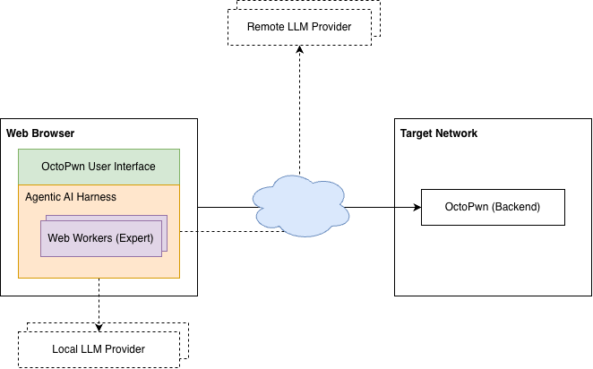

# OctoAgent

!!! info "Enterprise feature"
    OctoAgent ships with OctoPwn **Enterprise**.

OctoPwn's AI Assistant is a multi-agent AI solution that runs entirely within your web browser. It helps streamline penetration testing engagements while giving you access to the capabilities of the OctoPwn framework.

The AI Assistant can manage an engagement from start to finish, or work alongside you as a sidekick when you prefer to remain in control of the process.

## Architecture

You interact with the AI assistant through the OctoPwn User Interface (UI), which runs directly in your web browser. The underlying AI capabilities are provided by the Agentic AI Harness, an in-house solution designed specifically to operate within the browser. The harness was designed so that each [Expert](#experts) runs independently in its own dedicated [Web Worker](https://developer.mozilla.org/en-US/docs/Web/API/Web_Workers_API).

The following diagram provides a very high-level overview of the agentic AI architecture.

## Configuration

The following sections describe the key configuration options.

### LLM Setup

OctoPwn does not include its own LLM. Instead, you can choose from a range of LLM providers, including Anthropic, OpenAI, OpenRouter, Ollama, and other providers that offer an OpenAI-compatible API.

You can configure multiple LLM providers and models, then assign specific models to different Experts based on their role during an engagement. This allows you to combine models with different strengths, performance characteristics, or cost profiles within a single workflow.

Where possible, the Agentic AI Harness provides a filtered list of models for each provider, showing only those that support the core capabilities required to work effectively with the harness.

#### API Keys

Before configuring an LLM integration that requires authentication, you must first register an API key for the corresponding provider. Once registered, the key can be selected when configuring an LLM integration.

API keys are stored locally in your browser using [IndexedDB](https://developer.mozilla.org/en-US/docs/Web/API/IndexedDB_API). They are not exposed directly to the LLM or included in the messages sent to it. The Agentic AI Harness uses the selected key when communicating with the configured LLM provider.

Because OctoPwn is designed for penetration testing, the AI Assistant may interact with untrusted or potentially hostile systems and process attacker-controlled content during an engagement. Such content could, for example, attempt to influence the AI Assistant through prompt injection or exploit a vulnerability in OctoPwn or the browser-facing application.

Prompt injection alone does not provide the LLM with access to stored API keys. However, a successful cross-site scripting (XSS) vulnerability executing within an origin that has access to OctoPwn's IndexedDB storage could potentially access data stored there, including registered API keys.

OctoPwn implements measures intended to prevent XSS vulnerabilities and reduce their impact. Nevertheless, API keys should be treated as sensitive credentials, and we recommend applying the following additional safeguards:

- **Use a dedicated API key for OctoPwn.** Do not reuse a key that is used by other applications or services.
- **Apply the minimum required permissions.** Where supported by your LLM provider, restrict the key to the permissions and resources required for LLM inference. Avoid keys that can perform administrative or account-management operations.
- **Set an expiration date.** Where supported, use short-lived or automatically expiring API keys and rotate them regularly.
- **Set spending or usage limits.** Configure a finite budget, credit limit, or usage quota for the key where your provider supports it. This limits the potential financial impact if a key is compromised.
- **Monitor usage.** Review provider-side API usage and billing activity so that unexpected use of a key can be identified quickly.
- **Revoke keys that are no longer required.** Remove unused keys from OctoPwn and revoke them through the LLM provider when they are no longer needed.

These precautions are particularly important when using the AI Assistant against untrusted targets or when processing content controlled by third parties.

### Delegation Limits

You can configure the maximum number of [Experts](#experts) that can run concurrently across most Expert types, as well as set individual concurrency limits for each type.

### Permissions

The permission system follows OctoPwn's [Core Functionalities](gettingstarted.md). You can control which scanners, attacks, servers, and clients the LLM can access, as well as whether their use requires explicit user approval.

## Experts

You interact directly with the AI Assistant, which delegates work to the appropriate Expert types as needed throughout the engagement.

Below are descriptions of some of the key Experts and their respective roles.

- **Reconnaissance Expert**: Performs broad network discovery and enumeration, including port scanning, host discovery, SMB, LDAP, and Kerberos enumeration, and automated scanning.
- **Scanner Expert**: Runs targeted scanners and enumeration modules against specific hosts and services.
- **Client Expert**: Establishes authenticated protocol sessions, including SMB, LDAP, SSH, MSSQL, WMI, and RDP, to interact with services, execute commands, extract secrets, or perform operations such as DCSync.
- **Attack Expert**: Executes offensive attack modules, including Kerberoasting, AS-REP roasting, NTLM relay, password spraying, and other active attack techniques.

Each Expert has its own dedicated set of tools. Most of these tools allow the LLM to invoke functionality provided by the OctoPwn Backend.

## Human-in-the-Loop

OctoPwn provides several ways for you to remain in control and interact with the AI Assistant throughout an engagement:

- **Permission**: Whenever the AI Assistant or one of its Experts attempts to perform an operation that [requires permission](#permissions), you must explicitly approve the action before it can proceed.
- **Decision**: The AI Assistant may present you with options when your input is required during an engagement. You can select one of the proposed options or provide a free-form response to direct the engagement yourself.
- **Expert Termination**: You can terminate the AI Assistant along with any Experts it has spawned, or terminate individual Experts without stopping the AI Assistant or other active Experts.
- **Async Task Delegation**: The AI Assistant delegates most tasks to Experts asynchronously, allowing you to continue interacting with the AI Assistant while one or more Experts perform potentially long-running tasks in the background. This keeps you in control of the engagement, allowing you to provide additional instructions, specify what should happen once results become available, terminate running operations when they are no longer needed, or initiate additional tasks that run concurrently. **The only exception** is when the AI Assistant is waiting for the State or Planning Expert to complete a task. During this time, the AI Assistant does not accept additional messages and will resume interaction once the Expert has finished.
- **Transparency**: Although you interact directly only with the AI Assistant, the activity of all Experts is visible to you in real time, allowing you to follow delegated tasks and observe their progress throughout the engagement.

## Audit Trail

The audit trail provides a detailed record of all interactions and actions taken during an engagement, including your messages, tasks delegated by the AI Assistant, Expert activity, tool calls, and permission requests and responses. Each entry includes a timestamp, and the underlying LLM protocol messages can also be inspected in their raw JSON format for additional visibility into the interaction.
